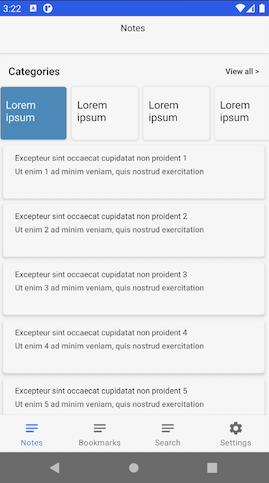

<H3 align="center">
Android Jetpack Compose & Kotless Sample Apps for Notes Management. 
</H3>

#### 🚧 Work In Progress (although the architecture and main components are ready) 🚧

## NotesCompose

This is a sample Android app built with Jetpack components. 
[Full version](https://github.com/AlexeyPerov/Flutter-Notes) is made with [Flutter](https://flutter.dev/)

The purpose is simply to try and learn new technologies.

## Libraries
- [Jetpack Compose](https://developer.android.com/jetpack/compose)
- [Kotless](https://github.com/JetBrains/kotless)
- [Firebase Firestore](https://firebase.google.com/docs/firestore)
- [ViewModel](https://developer.android.com/topic/libraries/architecture/viewmodel)
- [Navigation](https://developer.android.com/topic/libraries/architecture/navigation)
- [LiveData](https://developer.android.com/topic/libraries/architecture/livedata)
- [Coroutines](https://github.com/Kotlin/kotlinx.coroutines)
- [Dagger2](https://github.com/google/dagger)
- [Hilt](https://dagger.dev/hilt/)
- [Room](https://developer.android.com/topic/libraries/architecture/room)
- [Retrofit](https://github.com/square/retrofit)

## Android client

The client project consists of two modules

`:platform` contains mostly utilities
`:app` contains the client itself

This is a single-activity application. See app_navigation.xml and main_fragment_navigation.xml for navigation details.

There are three options for data repositories: Room, Retrofit, Firestore. All of them are available for basic functionality but RoomRepository is selected by default. To change it see RepositoriesModule.

## Kotless

Kotless serverless app is used to work with Retrofit repositories.
See instructions on how to run it in [Kotless page](https://github.com/JetBrains/kotless)

## Screenshots

